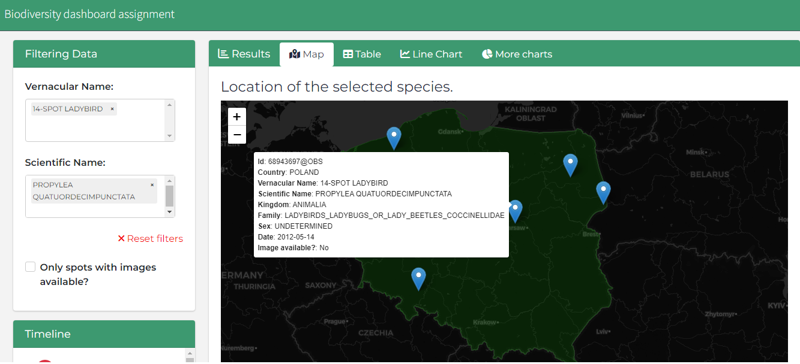
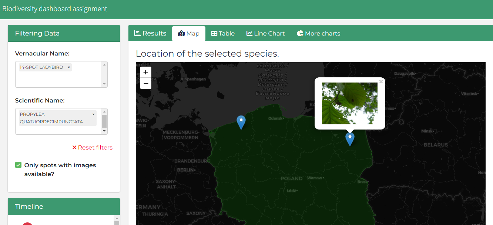

# Shiny Assignment

I built this dashboard using the **bs4Dash** package. The project can be seen at the link: https://arthurclm.shinyapps.io/Appsilon_assignment/

The dashboard works as follows:

When loading the screen, the user can observe two filters and a map, each of these filters represents the type of selection, one being by the "vernacularName" variable and the other by the "scientificName", it is worth nothing that when selecting a filter option "vernacularName", automatically the filter "scientificName" is updated and consequently the database of observations is updated as well. As a consequence, when updating the database, the tabs **Map**, **Table**, **Line Chart** and **'Other charts'** are updated automatically.

The user can also view table, timeline chart and so on for all database observations.

In the 'Map' tab, the user can observe the points on the map, when touching the observation, some information that i thought of some relevance to the user will appear, such as: 'Id', 'Country', 'Vernacular Name' , 'Scientific Name', 'Kingdom' and so on.

We can also see that there is another filter that the user can view only points with available images. To view these images, just click on the marker.

The tabs called **'Table', 'Line Chart', 'Other Charts'** are information regarding the database country of Poland. The first one is a summary of the filtered information, the second one is a time series graph of the information and the last tab is just some bar graphs of other variables that i thought interesting for the user to see. Also, I added a timeline on the left side.

All the steps to obtain the final database for the realization of this project are present in the **get.data.R** function, there I commented step by step all the approaches I had and my idea of how to extract the database of Poland.
